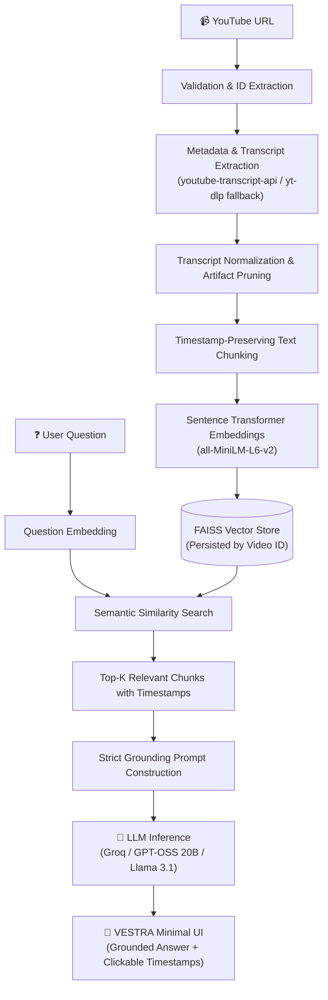

# 🎬 VESTRA — Ask beyond the video.

> **AI-powered YouTube RAG**

A production-grade **Retrieval-Augmented Generation (RAG)** application that allows users to chat with any YouTube video. VESTRA extracts, cleans, chunks, and indexes video transcripts into a local FAISS vector store, retrieving semantically relevant sections to produce strictly grounded answers with clickable video timestamps using high-speed LLM inference.

Eliminate the need to watch long hours of video just to find a specific answer!

---

## 🏗️ Architecture



---

## ✨ Features

- **Product-Grade Identity**: Clean, modern, distraction-free interface built for actual end users and research demos.
- **Strict Transcript Grounding**: Never supplements answers with ungrounded pretrained knowledge. Refuses unsupported questions gracefully.
- **Adaptive Answer Formats**: Naturally formats responses according to question type (definitions, explanations, lists, conclusions, or timestamp locations) without robotic boilerplate.
- **✨ Instant Video Summaries**: One-click grounded summary generator producing Overview, Key Points, Conclusion, and clickable timestamp references.
- **🧠 Transparent RAG Pipeline**: Built-in architecture visualizer and collapsible retrieved context inspector.
- **Multi-Format URL Parsing**: Supports standard watch URLs, short URLs (`youtu.be`), Shorts, embeds, and mobile links.
- **Robust Multi-Tier Transcript Extraction**:
  - Primary: `youtube-transcript-api` (supporting manual, auto-generated, and translation fallbacks).
  - Fallback: `yt-dlp` subtitle extraction (`json3`/`vtt`).
- **Timestamp-Aware Chunking**: Preserves exact `start_timestamp`, `end_timestamp`, and direct YouTube playback URLs (`&t=...s`).
- **High-Performance Semantic Search**:
  - `sentence-transformers/all-MiniLM-L6-v2` for dense normalized embeddings.
  - FAISS index persisted per video ID under `data/vectorstores/<video_id>/` to avoid re-indexing already processed videos.
- **Polished Source Chips**: Displays clean, clickable timestamp badges (`• [MM:SS](URL) — Topic`) with collapsed full-context drawers.

---

## 🛠️ Tech Stack

| Component | Technology |
|---|---|
| **Language** | Python 3.11+ |
| **Frontend** | Streamlit |
| **Orchestration & RAG** | Custom Modular Architecture |
| **Embeddings** | `sentence-transformers` (`all-MiniLM-L6-v2`) |
| **Vector Store** | FAISS (`faiss-cpu`) |
| **LLM Inference** | Groq (`openai/gpt-oss-20b`, `llama-3.1-8b-instant`) / Ollama / HF |
| **YouTube Extraction** | `youtube-transcript-api`, `yt-dlp` |
| **Testing** | `pytest` (46 tests passing) |

---

## 🚀 Installation & Setup

### 1. Clone & Navigate to Repository

```bash
cd D:\Youtube
```

### 2. Create and Activate Virtual Environment

**Windows:**
```bash
python -m venv venv
venv\Scripts\activate
```

**macOS/Linux:**
```bash
python3 -m venv venv
source venv/bin/activate
```

### 3. Install Dependencies

```bash
pip install -r requirements.txt
```

### 4. Configure Environment Variables

Create `.env` based on `.env.example`:

```env
LLM_PROVIDER=groq
MODEL_NAME=openai/gpt-oss-20b
GROQ_API_KEY=gsk_your_groq_api_key_here
```

---

## 💻 Running VESTRA

Launch the Streamlit web application:

```bash
streamlit run app.py
```

The app will open automatically in your browser at `http://localhost:8501`.

---

## 🧪 Running Tests

Execute the comprehensive test suite:

```bash
pytest -v
```

The test suite covers:
- Strict grounding rules & refusal of unsupported queries (`tests/test_grounding.py`)
- Question type adaptation & natural tone enforcement (`tests/test_grounding.py`)
- Video summary generation (`tests/test_grounding.py`)
- Source labeling and timestamp separation (`tests/test_grounding.py`)
- YouTube URL parsing & edge cases (`tests/test_youtube.py`)
- Transcript normalization & subtitle artifact cleaning (`tests/test_chunking.py`)
- Timestamp-preserving intelligent chunking (`tests/test_chunking.py`)
- Embedding dimensions & normalization (`tests/test_embeddings.py`)
- FAISS vector storage, similarity retrieval, and RAG QA pipeline (`tests/test_retrieval.py`)

---

## 📁 Project Structure

```
D:\Youtube/
├── app.py                     # VESTRA Streamlit frontend & chat interface
├── requirements.txt           # Project dependencies
├── README.md                  # Documentation and setup instructions
├── .env.example               # Example environment configuration
├── .env                       # Local environment configuration (API keys)
├── .gitignore                 # Git ignore rules
│
├── config/
│   ├── __init__.py
│   └── settings.py            # Centralized Pydantic settings
│
├── ingestion/
│   ├── __init__.py
│   ├── youtube_loader.py      # Video metadata extraction (yt-dlp & oEmbed)
│   ├── transcript_loader.py   # Multi-tier transcript retrieval & caching
│   ├── transcript_cleaner.py  # Subtitle artifact removal & text cleaning
│   └── chunker.py             # Timestamp-preserving intelligent chunker
│
├── embeddings/
│   ├── __init__.py
│   └── embedding_service.py   # Cached Sentence-Transformers service
│
├── vectorstore/
│   ├── __init__.py
│   └── faiss_store.py         # FAISS indexing & disk persistence per video ID
│
├── rag/
│   ├── __init__.py
│   ├── retriever.py           # FAISS semantic retrieval
│   ├── prompt.py              # Strict grounding prompt templates & summary builder
│   └── qa_chain.py            # End-to-end RAG QA coordinator & summary generator
│
├── llm/
│   ├── __init__.py
│   └── llama_service.py       # Multi-provider LLM service (Groq/Ollama/HF/Mock)
│
├── utils/
│   ├── __init__.py
│   ├── youtube_utils.py       # URL validation, video ID & timestamp helpers
│   └── logging_utils.py       # Standardized structured logging
│
├── data/
│   ├── transcripts/           # Cached raw/cleaned video transcripts
│   └── vectorstores/          # Persisted FAISS indexes per video ID
│
└── tests/
    ├── test_grounding.py      # Grounding, tone, summary, and source separation tests
    ├── test_youtube.py        # YouTube URL parsing & timestamp format tests
    ├── test_chunking.py       # Transcript cleaning & chunking tests
    ├── test_embeddings.py     # Embedding dimensions & normalization tests
    └── test_retrieval.py      # FAISS persistence & similarity tests
```
