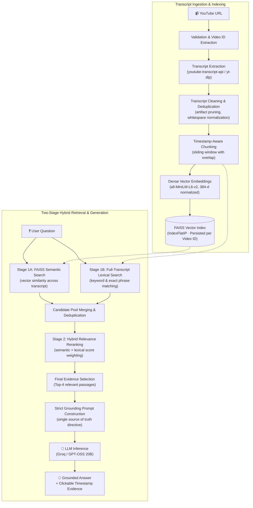

# 🎬 VESTRA — Ask beyond the video.

> **AI-powered YouTube RAG**

Ask questions about long-form YouTube videos and get transcript-grounded answers with clickable timestamps that let you verify the supporting evidence directly in the video.

VESTRA is a modular Retrieval-Augmented Generation (RAG) application that extracts, normalizes, chunks, and indexes YouTube video transcripts. By combining dense semantic search (FAISS) with keyword-level lexical matching and hybrid reranking, VESTRA identifies relevant transcript passages across the entire video and passes only the most relevant evidence to the LLM for strictly grounded generation.

---

## ✨ Features

- **Transcript-Grounded Q&A**: Ask natural-language questions about any processed video. Answers are derived strictly from the transcript without relying on external pre-trained knowledge.
- **Two-Stage Hybrid Retrieval**: Searches the complete transcript by merging FAISS dense vector search with exact lexical keyword/phrase matching, reranking candidates so relevant moments are never missed.
- **Strict Grounding & Graceful Refusal**: VESTRA is designed to prevent unsupported answers by restricting generation to retrieved transcript evidence. If the video does not cover a topic, it states so directly instead of hallucinating facts.
- **Clickable Timestamp Evidence**: Every supported response presents up to 4 direct evidence citations with clickable timestamp links (`• [MM:SS ↗](url)`) and quote passages linking to the exact playback moment on YouTube.
- **Timestamp-Aware Chunking**: Preserves temporal boundaries (`start_timestamp`, `end_timestamp`) across all chunks with configurable character sizing and overlap.
- **Multi-Tier Transcript Extraction**: Primary extraction via `youtube-transcript-api` (supporting manual, auto-generated, and translated tracks) with an automatic fallback to `yt-dlp` subtitle extraction (`json3`/`vtt`).
- **Persistent Per-Video Indexing**: Transcripts and FAISS indexes are cached locally by video ID under `data/transcripts/` and `data/vectorstores/<video_id>/`, allowing instantaneous subsequent reloads without re-indexing.
- **One-Click Grounded Summaries**: Generates a structured overview with key points and concluding takeaways drawn evenly across the video timeline.
- **Comprehensive URL Support**: Validates and parses standard watch URLs, short links (`youtu.be`), Shorts, embed URLs, mobile URLs, timestamped URLs, and raw 11-character video IDs.
- **Retrieval Transparency**: Expandable inspect drawers (`▶ View transcript evidence` and `▶ View retrieval details`) allow users to audit intermediate candidates and examine full chunk text.

---

## 🏗️ Architecture



---

## 🔍 How Retrieval Works

A core limitation of basic RAG systems is failing to retrieve evidence when relevant text is located far down a long transcript or when specific terminology isn't ranked in the first few vector neighbors. VESTRA solves this with a two-stage hybrid retrieval design:

1. **Full Transcript Indexing**: The complete transcript is chunked and made available to both dense vector indexing and full-text keyword scanning.
2. **Semantic Search (Stage 1A)**: FAISS performs cosine similarity search using normalized 384-dimensional embeddings generated by `all-MiniLM-L6-v2`, gathering top conceptual matches.
3. **Lexical Search (Stage 1B)**: A lexical matcher scans all transcript chunks for query keywords, plurals, inflections, and exact multi-word phrases.
4. **Candidate Merging & Deduplication**: Semantic and lexical candidate pools are merged and deduplicated by chunk ID.
5. **Hybrid Reranking (Stage 2)**: Candidates are scored with a weighted formula prioritizing exact phrase hits and keyword coverage combined with semantic similarity.
6. **Final Evidence Selection**: Exactly up to 4 top-ranked evidence chunks are selected.
7. **Focused LLM Context**: **Only the final selected evidence is passed to the LLM**. The entire transcript is never sent in prompt context, ensuring fast inference, low latency, and zero prompt-stuffing degradation.
8. **Direct Evidence Citation**: The exact same evidence passages provided to the model are rendered to the user as clickable citations.

---

## 🎯 Grounded Answers & Evidence

VESTRA is built around **strict transcript grounding**:

- **Transcript as Sole Truth**: The retrieved transcript chunks are the only facts the model may use. Pre-trained general knowledge cannot be used to introduce facts not present in the video.
- **Graceful Refusal**: When a user asks about a topic not covered in the transcript (e.g., asking about backpropagation in a video that only covers neural network structure), VESTRA explicitly states that the video does not provide enough information.
- **Evidence from the Video**: Supported answers display clickable timestamp chips (`• [MM:SS ↗](url)`) paired with italicized excerpt quotes. Users can click any timestamp to jump directly to that point in the YouTube video.
- **Separation of Candidates vs. Evidence**: In unsupported responses, irrelevant chunks are never presented as supporting evidence. Intermediate search candidates remain strictly inside an optional debugging drawer.

---

## 🛠️ Tech Stack

| Component | Technology | Description |
|---|---|---|
| **Language** | Python 3.10+ / 3.11 | Core application programming language |
| **Frontend UI** | Streamlit (>= 1.35.0) | Interactive web interface with chat state management |
| **Embeddings** | `sentence-transformers` (`all-MiniLM-L6-v2`) | 384-dimensional dense normalized embeddings |
| **Vector Store** | FAISS (`faiss-cpu` >= 1.8.0) | In-memory Inner Product (`IndexFlatIP`) with per-video disk persistence |
| **LLM Inference** | Groq (`openai/gpt-oss-20b`) | Primary high-speed LLM inference (supports Ollama, HuggingFace, OpenAI-compatible endpoints, and offline mock) |
| **Transcript Loading** | `youtube-transcript-api` & `yt-dlp` | Dual-tier caption extraction with format parsing (`json3`/`vtt`) |
| **Configuration** | Pydantic Settings & `python-dotenv` | Centralized type-safe environment configuration |
| **Test Suite** | `pytest` | 55 automated unit and integration tests |

---

## 🚀 Installation

### 1. Clone the Repository

```bash
git clone https://github.com/Tushar15769/VESTRA.git
cd VESTRA
```

### 2. Set Up a Virtual Environment

**Windows:**
```bash
python -m venv venv
venv\Scripts\activate
```

**macOS / Linux:**
```bash
python3 -m venv venv
source venv/bin/activate
```

### 3. Install Dependencies

```bash
pip install -r requirements.txt
```

---

## 🔐 Environment Variables

VESTRA manages configuration through environment variables. Copy the example configuration to create your local `.env` file:

```bash
# Windows
copy .env.example .env

# macOS / Linux
cp .env.example .env
```

Configure your LLM provider credentials in `.env`:

```env
# Primary / Recommended Provider
LLM_PROVIDER=groq
MODEL_NAME=openai/gpt-oss-20b
GROQ_API_KEY=your_groq_api_key_here

# Alternative Providers (Optional)
# LLM_PROVIDER=ollama
# MODEL_NAME=llama3.1
# OLLAMA_BASE_URL=http://localhost:11434

# LLM_PROVIDER=huggingface
# MODEL_NAME=meta-llama/Llama-3.1-8B-Instruct
# HUGGINGFACE_API_TOKEN=your_hf_token_here

# Retrieval & Chunking Settings
EMBEDDING_MODEL_NAME=sentence-transformers/all-MiniLM-L6-v2
CHUNK_SIZE=1000
CHUNK_OVERLAP=150
RETRIEVAL_CANDIDATES=10
TOP_K=4
TEMPERATURE=0.2
MAX_TOKENS=1024
```

> [!NOTE]
> `.env` contains private API keys and is excluded from source control via `.gitignore`. If no API key is configured, VESTRA automatically falls back to an offline mock service for testing and interface inspection.

---

## 💻 Running VESTRA

Start the Streamlit application:

```bash
streamlit run app.py
```

Streamlit will launch the web application locally (typically at `http://localhost:8501`).

---

## 🧪 Testing

The repository includes a comprehensive `pytest` test suite covering URL extraction, chunking, embeddings, grounding directives, hybrid retrieval, and refusal logic.

Run the full test suite:

```bash
pytest -v
```

### Test Suite Breakdown (55 Passed)

- **`tests/test_youtube.py` (27 tests)**: Validates YouTube URL parsing across standard, shortened, Shorts, embed, mobile URLs, parameter variants, raw IDs, invalid links, and timestamp formatting (`MM:SS`, `HH:MM:SS`).
- **`tests/test_chunking.py` (5 tests)**: Verifies text cleaning (removal of noise artifacts like `[Music]`, `♪`), whitespace normalization, consecutive deduplication, sliding window chunking, and metadata preservation.
- **`tests/test_embeddings.py` (3 tests)**: Tests batch document embedding, query embedding, normalization vectors, and empty input handling.
- **`tests/test_grounding.py` (10 tests)**: Asserts prompt formatting, strict grounding rules, avoidance of robotic conversational filler, refusal phrase detection, suppression of sources on ungrounded answers, and summary workflow generation.
- **`tests/test_retrieval.py` (10 tests)**: Validates FAISS persistence, loading, candidate expansion, exact keyword matching, semantic-only queries, deduplication, and regression recovery for information placed late in transcripts.

```text
55 passed in 17.60s
```

---

## 📁 Project Structure

```
VESTRA/
├── app.py                     # Streamlit web application and UI layout
├── requirements.txt           # Project dependencies
├── README.md                  # Project documentation
├── .env.example               # Template environment configuration
├── .gitignore                 # Git ignore rules for env, caches, and vector stores
│
├── config/
│   ├── __init__.py
│   └── settings.py            # Centralized Pydantic settings and directory setup
│
├── ingestion/
│   ├── __init__.py
│   ├── youtube_loader.py      # Video metadata extraction (yt-dlp with oEmbed fallback)
│   ├── transcript_loader.py   # Transcript extraction (youtube-transcript-api with yt-dlp fallback)
│   ├── transcript_cleaner.py  # Subtitle artifact removal and text normalization
│   └── chunker.py             # Timestamp-preserving intelligent text chunker
│
├── embeddings/
│   ├── __init__.py
│   └── embedding_service.py   # Singleton Sentence-Transformers embedding service
│
├── vectorstore/
│   ├── __init__.py
│   └── faiss_store.py         # FAISS IndexFlatIP store with disk persistence per video ID
│
├── rag/
│   ├── __init__.py
│   ├── retriever.py           # Two-stage hybrid full-transcript retriever (vector + lexical)
│   ├── prompt.py              # Strict grounding prompt templates & summary builder
│   └── qa_chain.py            # RAG QA coordinator, passage formatter, and summary handler
│
├── llm/
│   ├── __init__.py
│   └── llama_service.py       # Multi-provider LLM interface (Groq, Ollama, HuggingFace, Mock)
│
├── utils/
│   ├── __init__.py
│   ├── youtube_utils.py       # URL validation, video ID parsing, and timestamp utilities
│   └── logging_utils.py       # Structured logging utility
│
├── data/
│   ├── transcripts/           # Local cache for extracted video transcripts (gitignored)
│   └── vectorstores/          # Local cache for FAISS indexes by video ID (gitignored)
│
└── tests/
    ├── __init__.py
    ├── test_youtube.py        # URL parsing and timestamp tests
    ├── test_chunking.py       # Transcript cleaning and chunking tests
    ├── test_embeddings.py     # Embedding service tests
    ├── test_grounding.py      # Grounding prompt and refusal tests
    └── test_retrieval.py      # Hybrid retrieval, FAISS, and pipeline tests
```

---

## 📌 Design Principles

1. **Transcript-First Grounding**: Answers are bounded by what the speaker actually said. The model is forbidden from using pre-trained knowledge to supplement unstated facts.
2. **Searchable Full Transcript, Small LLM Context**: The entire video transcript is indexed and searchable via hybrid retrieval, but only the top 4 relevant passages are passed to the LLM, preserving focus, response speed, and token efficiency.
3. **Evidence-Based Answers**: Every factual response provides direct citations with formatted transcript excerpts and clickable timestamps linked to the exact playback moment on YouTube.
4. **Transparent Verification**: Users are given access to the full transcript excerpts (`▶ View transcript evidence`) and the search candidate pool (`▶ View retrieval details`) for complete retrieval observability.
